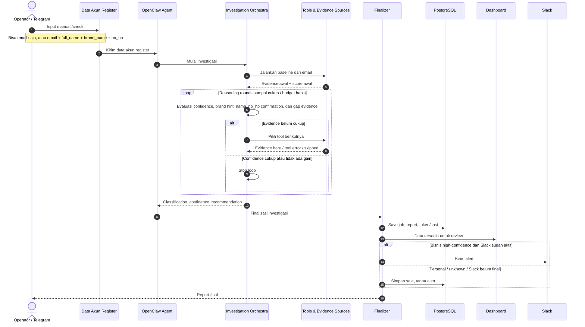

# High Level Business Flow

**Project:** AI Company Detection Agent  
**Audience:** Product, business, operator  
**Last updated:** 20 Mei 2026

---

## 1. Fungsi Dokumen Ini

Dokumen ini menjelaskan **alur bisnis end-to-end**: data akun masuk dari mana, sistem mengambil keputusan apa, hasilnya disimpan ke mana, dan operator melihatnya di mana.

Kalau butuh detail teknis seperti script, package Go, loop AI, dan stop condition, baca [Flow Map](../technical/FLOW_MAP.md).

Input tidak selalu cuma email. Sistem bisa jalan dengan email saja, tetapi hasilnya lebih kaya kalau form register mengirim data akun lengkap.

```text
Minimum:
  email

Lebih lengkap:
  email + full_name + brand_name + no_hp
```

---

## 2. Business Sequence



---

## 3. Input Bisnis

| Field | Status | Fungsi |
|---|---|---|
| `email` | Wajib | Sinyal utama untuk domain, local-part, search, dan scoring |
| `full_name` | Opsional | Membantu cocokkan orang yang sama |
| `brand_name` | Opsional | Sinyal bisnis paling kuat dari form register |
| `no_hp` | Opsional | Konfirmasi saja; tidak dipakai untuk public search |

Supported modes dari kode:

```text
company-check --email user@gmail.com

company-check \
  --email user@gmail.com \
  --full-name "Nama User" \
  --brand-name "Nama Brand" \
  --no-hp "08123456789"

company-check --input-json '{"email":"user@gmail.com","full_name":"Nama User","brand_name":"Nama Brand","no_hp":"08123456789"}'
```

Alias input yang diterima:

| Canonical | Alias |
|---|---|
| `email` | `Email`, `mail` |
| `full_name` | `fullName`, `name`, `nama` |
| `brand_name` | `brandName`, `company_field`, `company`, `brand` |
| `no_hp` | `noHp`, `phone`, `hp` |

---

## 4. Keputusan Bisnis

| Output | Arti | Action |
|---|---|---|
| `possible_company_affiliated` | Ada sinyal bisnis/perusahaan | Masuk kandidat B2B/company handling |
| `likely_personal_email` | Cenderung akun personal | Lanjut flow personal |
| `unknown_needs_more_evidence` | Evidence belum cukup | Simpan, retry/review nanti |
| `suspicious_or_invalid` | Invalid/disposable/risky | Manual risk review |

---

## 5. Jalur Yang Sudah Jadi

```text
Telegram / manual investigation with email-only or full account data
  -> OpenClaw Agent
  -> Investigation Orchestra
  -> finish_investigation.sh
  -> PostgreSQL
  -> Dashboard
```

Ini adalah jalur utama yang sudah divalidasi untuk penyimpanan hasil investigasi.

---

## 6. Jalur Pengembangan Akhir

```text
Platform register webhook
  -> deterministic response cepat
  -> DB/dashboard persistence final
  -> Slack routing final
```

Webhook service sudah tersedia dan bisa memberi response deterministik, tetapi jalur production sampai DB/dashboard masih final integration. Slack routing juga diselesaikan di fase akhir yang sama.

---

## 7. Operator Outcome

Operator memakai dashboard untuk:

- melihat semua investigasi,
- filter classification dan confidence,
- membaca AI report lengkap,
- melihat evidence social/marketplace/role,
- melihat LLM cost,
- memberi review status.

Dashboard:

```text
http://103.226.139.107:3001
```
