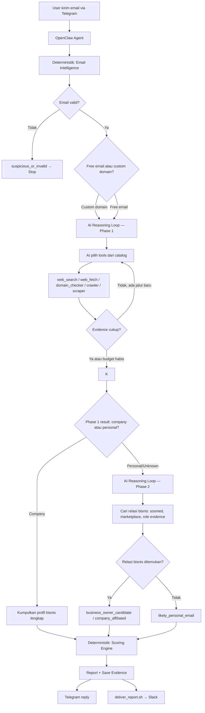
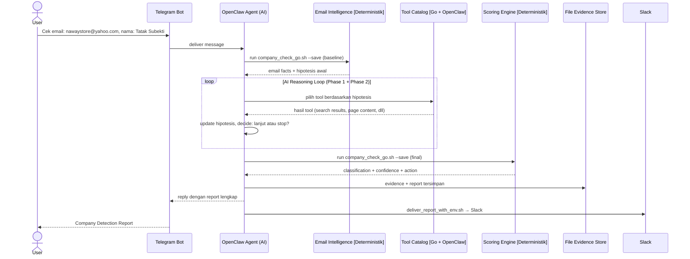
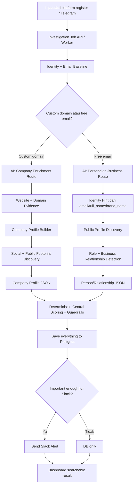

# High Level Business Flow

Dokumen ini menjelaskan alur utama dari input sampai output di level abstraksi tinggi.

- Kalau mau tahu detail teknis dan decision points, baca [FLOW_MAP.md](../technical/FLOW_MAP.md).
- Kalau mau tahu algoritma setiap tool, baca [TOOLS_AND_ALGORITHMS.md](../technical/TOOLS_AND_ALGORITHMS.md).

---

## 0. Mental Model

Sistem ini adalah **Agentic Company Detector** — sama seperti agentic coding, tapi untuk investigasi bisnis.

```text
Layer 1 — Deterministik (Go packages):
  Validasi email, scoring, storage, delivery
  Cepat, predictable, auditable
  Juga berfungsi sebagai FALLBACK MODE ketika AI tidak tersedia

Layer 2 — AI Reasoning Loop (OpenClaw Agent) — PRIMARY MODE:
  Observe → Orient → Decide → Act → loop
  AI pilih tools, iterate dari temuan, pivot strategi
  Kalau tool gagal → cari alternatif dari catalog
  Loop sampai confidence cukup atau budget habis
```

Flow sekarang (Phase A aktif):

```text
Input → [Deterministik] normalisasi + email intelligence + hipotesis awal
      → [AI] reasoning loop (iterate tools, 2 phase)
      → [Deterministik] scoring + output
```

Inti produknya: **mengubah email/register input menjadi keputusan bisnis yang bisa dipakai automation**.

---

## 1. Flow Sekarang: Phase A (AI Reasoning Loop Aktif)

### 1.1 Business Flowchart Sekarang



### 1.2 Yang Terjadi Di Setiap Layer

| Layer | Apa yang terjadi | Teknologi | Output |
|---|---|---|---|
| Input | User kirim email + metadata | Telegram + OpenClaw | Raw message |
| Email Intelligence | Validasi, klasifikasi domain, hipotesis awal | Go `internal/emailintel` | Email facts |
| AI Reasoning Loop | Investigasi iteratif: pilih tool → baca hasil → update hipotesis → lanjut/stop | OpenClaw Agent + tool catalog | Evidence collection |
| Tool Catalog | Go tools (domain_checker, crawler, scraper, search cascade) + OpenClaw built-in (web_search, web_fetch, browser) | Go packages + OpenClaw | Evidence items |
| Scoring | Hitung confidence dari semua evidence | Go `internal/scoring` | Classification + score |
| Report | Format report (AI narasi + Go scoring summary) | Go `internal/report` (fallback) / AI (primary) | Report text |
| Storage | Simpan JSON/report untuk audit | Go `internal/evidence` | `evidence/*.json` |
| Delivery | Kirim ke Telegram + Slack | Telegram (langsung) + `deliver_report.sh` | Final report |

### 1.3 Sequence Diagram Sekarang



### 1.4 Output Sekarang

```text
Company Detection Report

PHASE 1: Identifikasi Bisnis
Classification: [possible_company_affiliated / likely_personal_email / unknown / suspicious]
Confidence: N/100

[Round 1 — dari input awal]
  Hipotesis    : "nawaystore" → brand hint
  Tool         : web_search("nawaystore tokopedia OR instagram")
  Hasil        : instagram.com/nawaystore ditemukan
  Membuka jalur: fetch Instagram

[Round 2 — dari Round 1]
  Tool         : web_fetch("instagram.com/nawaystore")
  Hasil        : bio = "Naway.inc | WA: 085xxx | nawaystore.id"
  Phone match  : YES → +25 confidence

[Round 3 — dari Round 2]
  Tool         : web_fetch("nawaystore.id/about")
  Hasil        : "Tatak Subekti — Owner"
  Stop karena  : confidence >= 75, explicit role evidence

PHASE 2: Relasi Bisnis (jika Phase 1 = personal/unknown)
  [reasoning rounds...]

Temuan:
  Profil Bisnis: nama, domain, website, deskripsi
  Sosial Media: LinkedIn, Instagram, Tokopedia, TikTok, dll
  Lokasi: alamat, Maps
  Role Evidence: "[quote]" — [source] — reliability: high
  Phone Confirmation: match/no match/not checked

[Deterministik] Scoring Engine
  Base score: 35, Total delta: +N, Final: N/100
  Classification: ..., Action: ...
```

Classifications:
- `possible_company_affiliated`
- `likely_personal_email`
- `unknown_needs_more_evidence`
- `suspicious_or_invalid`

---

## 2. Flow Level 2: Enrichment Penuh (Planned)

Setelah Phase A terbukti, sistem akan diperluas dengan Postgres, queue, dan dashboard.

### 2.1 Business Flowchart Level 2



### 2.2 Comparison: Sekarang vs Level 2

| Area | Sekarang (Phase A) | Level 2 (Planned) |
|---|---|---|
| Main question | Bisnis atau personal? + relasi bisnis? | Siapa perusahaannya, sosmednya apa, lokasinya mana? |
| Orchestration | AI reasoning loop (single agent) | Worker/job system + multi-agent |
| Storage | File JSON/TXT | Postgres |
| Company domain | AI cari profil + sosmed + lokasi | Company profile builder + social extractor |
| Free email | AI cari relasi bisnis dari nama/brand | Personal-to-business discovery yang lebih structured |
| Slack | Semua hasil (sekarang) → nanti hanya penting | Alert hanya untuk company/high-value |
| Dashboard | Tidak ada | Search/review semua hasil |

---

## 3. Where The Complexity Lives

```text
Input → Investigation → Scoring → Output
```

Kompleksitas ada di `Investigation` — tapi sekarang AI yang handle, bukan pipeline kaku:

```text
Investigation (AI Reasoning Loop) =
  email baseline [Deterministik]
  + AI pilih jalur: company route atau personal-business route
  + AI iterate tools sampai confident
  + Scoring [Deterministik]
```

Aturan yang tidak boleh berubah:
- Final scoring selalu deterministik
- AI tidak boleh membuat classification tanpa evidence dari tools
- Storage dan delivery selalu deterministik
