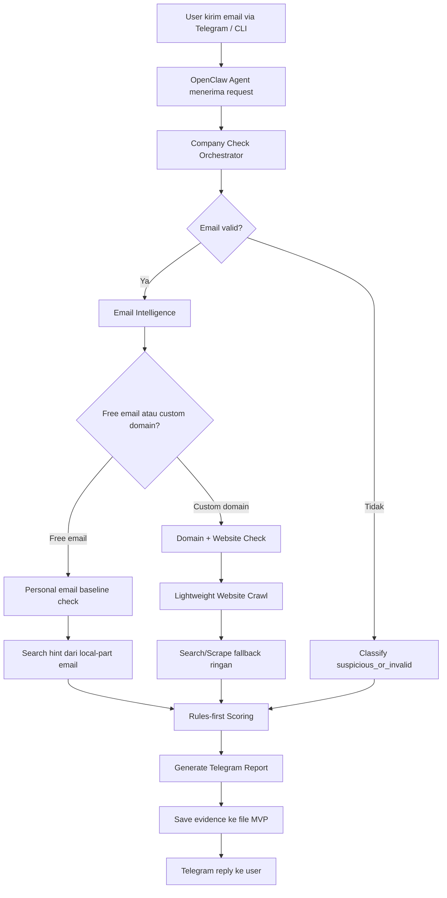
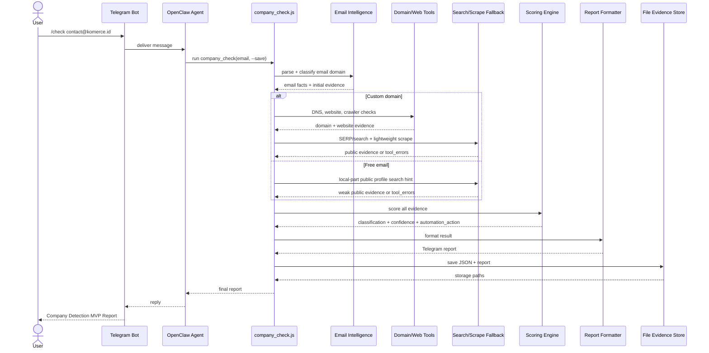
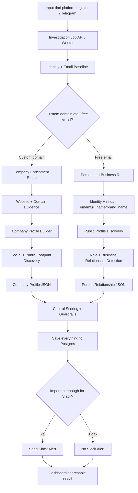
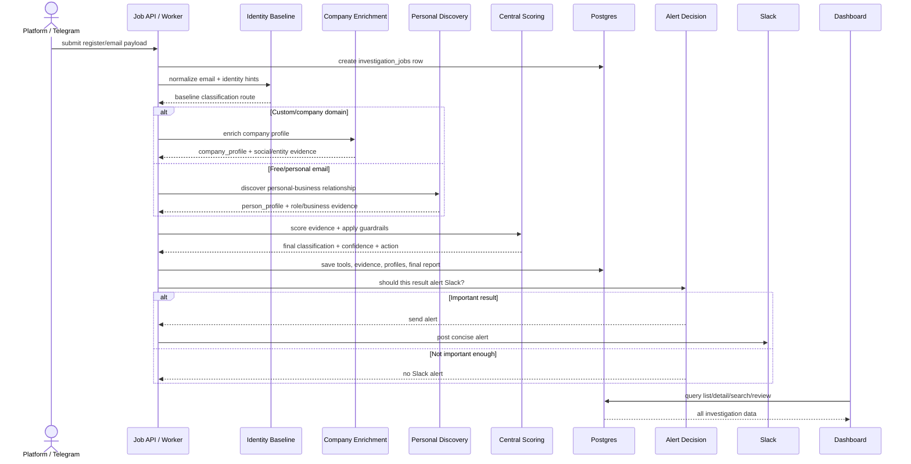

# High Level Business Flow

Dokumen ini menjelaskan alur utama dari input sampai output di level abstraksi tinggi. Fokusnya bukan detail script satu per satu, tapi gambaran besar: data masuk dari mana, diproses oleh lapisan apa, pindah ke teknologi apa, lalu output akhirnya apa.

Cara baca dokumen ini:

- Kalau mau tahu gambaran besar bisnis/logika utama, baca dokumen ini.
- Kalau mau tahu detail script dan branching teknis, baca [FLOW_MAP.md](../technical/FLOW_MAP.md).
- Kalau mau tahu algoritma setiap tool/agent, baca [TOOLS_AND_ALGORITHMS.md](../technical/TOOLS_AND_ALGORITHMS.md).

Ada dua versi:

1. **Flow sekarang**: Telegram MVP yang sudah berjalan.
2. **Flow level 2**: versi enrichment yang direncanakan, dengan company profile dan personal-to-business discovery.

## 0. Mental Model Paling Pendek

Versi sekarang punya 3 langkah besar:

```text
Input email -> cek sinyal perusahaan/personal -> keluarkan classification + evidence summary.
```

Versi level 2 punya 4 langkah besar:

```text
Input identity/register -> cek route company/personal -> enrich profil/relasi bisnis -> keluarkan structured result untuk automation.
```

Jadi inti produknya bukan "simpan ke SQL" atau "kirim Slack". Itu cuma delivery/storage. Inti produknya adalah **mengubah email/register input menjadi keputusan bisnis yang bisa dipakai automation**.

## 1. Flow Sekarang: Telegram MVP

Tujuan flow sekarang:

```text
Menerima email -> menentukan apakah email kemungkinan terkait perusahaan -> mengirim report hasil ke Telegram.
```

### 1.1 Business Flowchart Sekarang



### 1.2 Yang Terjadi Di Setiap Layer

| Layer | Apa yang terjadi | Teknologi sekarang | Output antar-layer |
|---|---|---|---|
| Input | User mengirim `/check email` atau email langsung. | Telegram + OpenClaw Gateway | Raw user message |
| Agent Router | Agent mengenali email dan memanggil command utama. | OpenClaw Agent + `AGENTS.md` | `node scripts/company_check.js <email> --save` |
| Orchestrator | Mengatur urutan pengecekan dan menggabungkan hasil. | `company_check.js` | Investigation result draft |
| Email Intelligence | Validasi email, cek free/custom domain, role mailbox, disposable. | `email_intelligence.js` | Email facts + evidence awal |
| Domain/Web Check | Untuk custom domain: cek DNS, MX, website aktif, title. | `domain_checker.js` | Domain evidence |
| Website Crawl | Untuk custom domain: cek halaman umum seperti `/about`, `/team`, `/contact`. | `website_crawler_router.js` | Website page evidence |
| Search/Scrape Fallback | Search ringan dan scrape ringan kalau ada URL aktif. | `ddg_search.js`, `free_scraper.js` | Low-reliability public evidence |
| Scoring | Hitung confidence dan classification. | `scoring_engine.js` | Classification + score + action |
| Report | Buat report Bahasa Indonesia untuk Telegram. | `report_formatter.js` | Telegram text |
| Storage MVP | Simpan JSON/report untuk audit. | `evidence_store.js` file-based | `evidence/*.json`, `reports/*.txt` |
| Output | Kirim hasil ke user. | Telegram | Final report |

### 1.3 Sequence Diagram Sekarang



### 1.4 Output Sekarang

Output utama:

```text
Company Detection MVP Report
```

Isi output:

- email input
- kesimpulan sementara/final
- classification
- confidence
- proses berhasil
- proses gagal
- proses dilewati
- evidence
- rekomendasi automation

Classification saat ini:

- `possible_company_affiliated`
- `likely_personal_email`
- `unknown_needs_more_evidence`
- `suspicious_or_invalid`

## 2. Flow Level 2: Email-First Enrichment

Tujuan flow level 2:

```text
Menerima email -> mendeteksi company/personal -> memperkaya profil perusahaan atau relasi bisnis personal -> menghasilkan JSON lengkap + alert penting.
```

Perbedaannya: sistem tidak berhenti setelah tahu “ini email perusahaan”. Sistem lanjut mencari **perusahaan apa, sosial medianya apa, bisnisnya apa, dan apakah email personal punya hubungan bisnis**.

### 2.1 Business Flowchart Level 2



### 2.2 Yang Terjadi Di Setiap Layer Level 2

| Layer | Apa yang terjadi | Teknologi target | Output antar-layer |
|---|---|---|---|
| Input | Data register masuk dengan `email`, `full_name`, `no_hp`, dan `brand_name`. Minimal tetap `email`. | Platform backend / Telegram | Register payload |
| Job API / Worker | Membuat job investigasi dan mengatur lifecycle. | Node.js worker/API + queue | `investigation_job` |
| Email Baseline | Validasi email, route custom vs free. | Existing email intelligence | Identity baseline |
| Company Route | Kalau custom domain, cari profil perusahaan. | Domain tools + crawler + profile builder | `company_profile` |
| Social Footprint | Cari LinkedIn, Instagram, X, TikTok, Facebook, YouTube, Maps/local signal. | Search provider + scraper + social extractor | Social/entity candidates |
| Personal Route | Kalau free email, cari apakah orang punya hubungan bisnis. | Local-part/full_name/brand_name search + public profile checker | `person_profile` |
| Role Detection | Cari sinyal CEO/founder/owner/agency/freelancer. | Role signal extractor + relationship scorer | `business_relationship` |
| Central Scoring | Menentukan final classification dan confidence. | Scoring engine + guardrails | Final result |
| Storage | Semua data masuk DB. | Postgres | Full audit trail |
| Alerting | Slack hanya untuk hasil penting. | Alert decision + Slack reporter | Slack alert or no alert |
| Dashboard | Semua hasil bisa dicari/review. | Web dashboard | Searchable records |

### 2.3 Sequence Diagram Level 2



### 2.4 Output Level 2

Output level 2 bukan cuma Telegram text. Ada tiga output:

1. **Structured JSON**
   Dipakai platform automation dan dashboard.

2. **Slack alert**
   Hanya untuk hasil penting.

3. **Dashboard record**
   Semua hasil bisa dicari dan direview.

Secara garis besar, output level 2 harus menjawab:

- email ini company, personal, suspicious, atau unknown?
- kalau company, perusahaan apa dan bukti publiknya apa?
- kalau personal, apakah ada relasi bisnis yang cukup kuat?
- confidence-nya berapa?
- automation action-nya apa?
- evidence mana yang mendukung keputusan itu?

## 3. Comparison: Sekarang vs Level 2

| Area | Sekarang | Level 2 |
|---|---|---|
| Main question | Apakah email ini perusahaan/personal? | Siapa perusahaan/orangnya dan apa relasi bisnisnya? |
| Input | Email dari Telegram/CLI | Register payload: email + optional full_name/no_hp/brand_name |
| Orchestration | Single script orchestrator | Worker/job system, later multi-agent |
| Storage | File JSON/TXT | Postgres |
| Company domain | Classify + basic evidence | Company profile + social footprint |
| Free email | Mostly personal/unknown | Search personal-business relationship |
| Social accounts | Not normalized | Extracted as entity candidates/social profiles |
| Address/Maps | Not implemented | Maps/local signal candidate |
| Slack | Optional manual send | Alert only for important results |
| Dashboard | Not available | Search/review all checks |
| Multi-agent | Not active | Possible after job contracts stable |

## 4. One-Sentence Explanation

Versi sekarang:

```text
User kasih email, OpenClaw menjalankan deterministic company check, sistem mengumpulkan bukti ringan, memberi classification/confidence, menyimpan evidence file, lalu membalas Telegram.
```

Versi level 2:

```text
Platform mengirim data register, worker membuat job, sistem memilih jalur company atau personal-business discovery, memperkaya profil dan social footprint, menyimpan semua ke Postgres, mengirim Slack hanya jika penting, dan menampilkan semua hasil di dashboard.
```

## 5. Where The Complexity Lives

Di level tinggi, flow tetap sederhana:

```text
Input -> Investigation -> Scoring -> Output
```

Kompleksitas hanya ada di dalam `Investigation`:

```text
Investigation =
  email baseline
  + company route
  + personal route
  + search/scrape tools
  + evidence collection
```

Supaya tidak membingungkan:

- Final scoring tetap satu tempat.
- Slack decision tetap satu tempat.
- Storage tetap satu tempat.
- Tool baru harus masuk ke flow map.
- Agent baru hanya boleh mengumpulkan evidence, bukan membuat keputusan final sendiri.
