# Flow Map

**Project:** AI Company Detection Agent  
**Audience:** Developer / AI agent penerus  
**Status:** Active runtime map  
**Last updated:** 17 Juni 2026

---

## 1. Fungsi Dokumen Ini

Ini adalah **satu-satunya dokumen flow aktif**.

Source of truth:

- `PRD.md` untuk arah produk.
- `TRD.md` untuk arsitektur teknis.
- `FLOW_MAP.md` untuk alur dari input sampai output.

Dokumen plan, review, checklist, dan flow lama ada di `docs/archive/` dan tidak dipakai sebagai acuan aktif.

---

## 2. Reality Check

Status yang sesuai kondisi project sekarang:

| Area | Status Aktual |
|---|---|
| Input manual / Telegram | Jalur utama yang dipakai untuk investigasi |
| Go deterministic pipeline | Sudah jalan |
| OpenClaw AI reasoning loop | Sudah jalan sebagai layer investigasi |
| Finalizer `finish_investigation.sh` | Jalur valid untuk save evidence, DB writer, token usage |
| PostgreSQL + Dashboard | Sudah jalan |
| Webhook | Enqueue-only API sudah jalan dengan PostgreSQL `register_intake_jobs` |
| Queue worker | Sequential worker sudah jalan; satu job per waktu |
| Telegram delivery | Wajib untuk tiap investigasi queue/manual |
| Slack routing | Daily prospect digest jam 09:00 sudah jalan; realtime raw report disabled |
| Google review monitor | Current implementation deterministic; scheduler tersedia tetapi belum diaktifkan sampai authenticated API collect valid |
| Negative feedback monitor | Meta Graph polling MVP aktif; webhook optional/future; Google path menunggu API approval |

Jalur persistence yang sudah divalidasi:

```text
Manual/Telegram input
  -> OpenClaw / Investigation Orchestra
  -> Go deterministic baseline
  -> AI reasoning loop
  -> finish_investigation.sh
  -> db_writer.js
  -> PostgreSQL
  -> Dashboard

Platform register
  -> webhook intake
  -> queue
  -> sequential worker
  -> OpenClaw agent + Telegram delivery
  -> same investigation path
  -> DB/dashboard
  -> Slack digest jam 09:00
```

Review monitor adalah flow kedua yang terpisah:

```text
Google Business Profile API
  -> isolated API collector jam 21:00
  -> filter review 1-3 + dedupe
  -> dedicated review-monitor state
  -> Slack report jam 09:00
```

Negative feedback monitor aktif sekarang:

```text
Meta Graph API polling setiap 15 menit
  -> Facebook Page + Instagram Business comments
  -> normalized feedback inbox
  -> structured AI classifier hanya untuk komentar baru/berubah
  -> Telegram result selalu
  -> Slack hanya jika negatif

Optional/future:
  -> Meta Webhook kalau callback/subscription Meta App sudah aktif
  -> Google Business Profile rating 1-3 deterministic setelah API access approved
```

---

## 3. Actor Boundaries

| Boundary | Isi | Tanggung Jawab |
|---|---|---|
| Human / Platform | Operator Telegram, manual check, platform register webhook | Mengirim data akun |
| Webhook / Queue | Webhook service, PostgreSQL table `register_intake_jobs`, sequential worker | Menampung payload platform dan memproses satu per satu |
| OpenClaw AI | Telegram session, agent prompt, investigation orchestra, reasoning loop | Memutuskan langkah investigasi dan final report; tidak menulis storage langsung |
| Machine / Go Tools | Go CLI, email/domain/search/crawler/scoring/report/evidence packages | Mengeksekusi check deterministik dan menghasilkan evidence |
| Finalization | `finish_investigation.sh`, `db_writer.js`, token usage | Menutup investigasi dan menyimpan hasil |
| Storage / Output | PostgreSQL, file evidence, dashboard | Menjadi tempat review dan source data operasional |
| Slack Digest | Cron/digest script, Slack channel | Mengirim ringkasan prospect jam 09:00 dari data final di DB |
| Feedback Monitor | Google connector, Meta connector, dedicated classifier/queues/schema, Telegram + Slack APIs | Google rating 1-3 tanpa AI; Meta comments dengan structured AI; Telegram selalu; Slack hanya negatif |

## 3.1 Active Negative Feedback Monitor

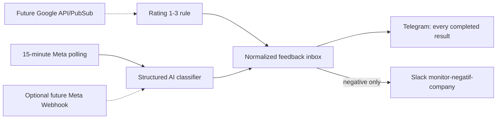

Detail source contract, queues, schema, classifier output, failure handling, dan
implementation phases ada di
`docs/technical/NEGATIVE_FEEDBACK_MONITOR_ARCHITECTURE.md`.

## 3.2 Current And Target Feature Boundary Flowchart

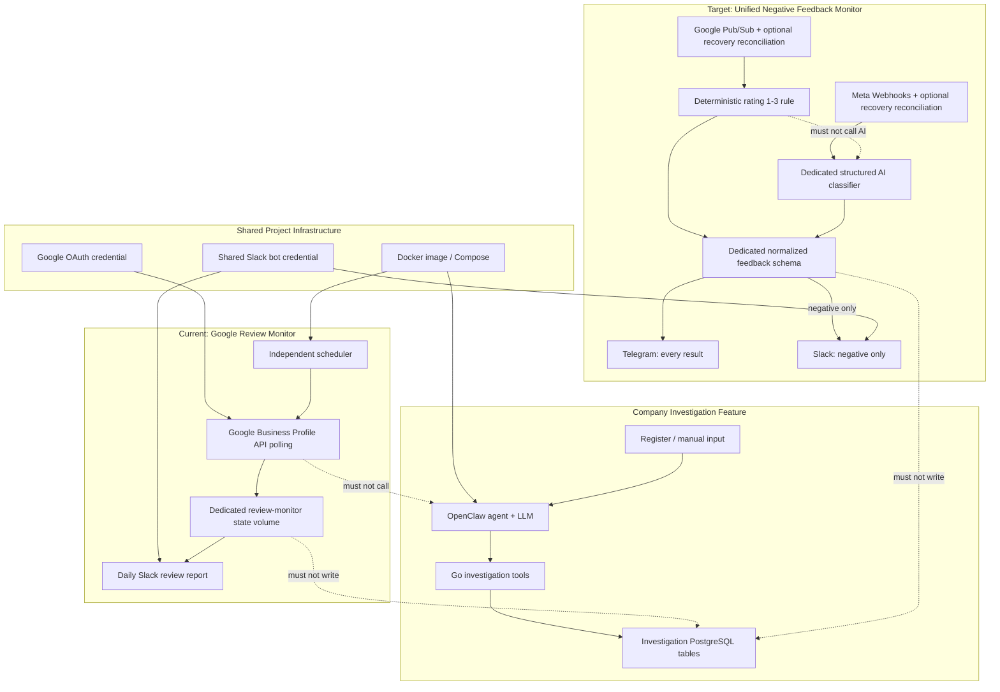

## 3.3 Google Review Monitor Sequence

Current active polling implementation before optional webhook migration:

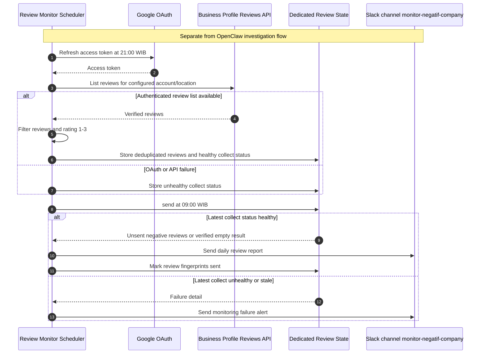

## 3.4 Target Feedback Monitoring Sequence

```mermaid
sequenceDiagram
  autonumber
  participant Platform as Google Pub/Sub / Meta Webhook
  participant Ingress as Feedback Ingress
  participant DB as Feedback PostgreSQL Queue
  participant Worker as Sequential Feedback Worker
  participant API as Google / Meta API
  participant AI as Meta Structured Classifier
  participant Telegram
  participant Slack as Slack monitor-negatif-company

  Platform->>Ingress: Review/comment created or updated
  Ingress->>DB: Validate and insert idempotent event
  Ingress-->>Platform: Technical ACK after durable insert
  Note over Platform,Ingress: ACK prevents platform retry; it is not a monitoring report

  Worker->>DB: Lock oldest pending event
  Worker->>API: Fetch current feedback and minimum context
  API-->>Worker: Review/comment detail

  alt Google review
    Worker->>Worker: Rating 1-3 deterministic rule
  else Meta comment
    Worker->>AI: Fixed prompt + structured output
    alt AI request succeeds
      AI-->>Worker: negative / non_negative / needs_review
    else Provider/auth/model/timeout/output failure
      AI-->>Worker: Retryable failure
      Worker->>DB: retry_pending or blocked_provider
      Note over Worker,DB: Requeue after provider health/config change; no result assumed safe
      break Classification incomplete; await replay
        Worker->>DB: Do not enqueue normal Telegram/Slack result
      end
    end
  end

  Worker->>DB: Store classification and enqueue Telegram
  DB-->>Telegram: Send every completed monitoring result

  alt Result is negative
    Worker->>DB: Enqueue Slack negative alert
    DB-->>Slack: Send immediately
  else Result is non-negative or needs-review
    Worker->>DB: No Slack delivery
  end
```

---

## 4. End-To-End Sequence Dengan Pemisah Area

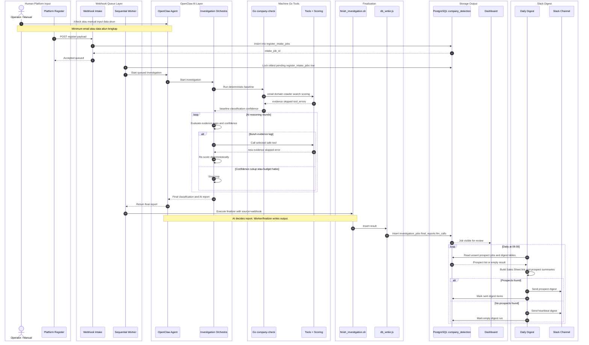

---

## 5. Area Map Tambahan

Diagram ini cuma peta ringkas area. Sequence utama tetap ada di section 4.

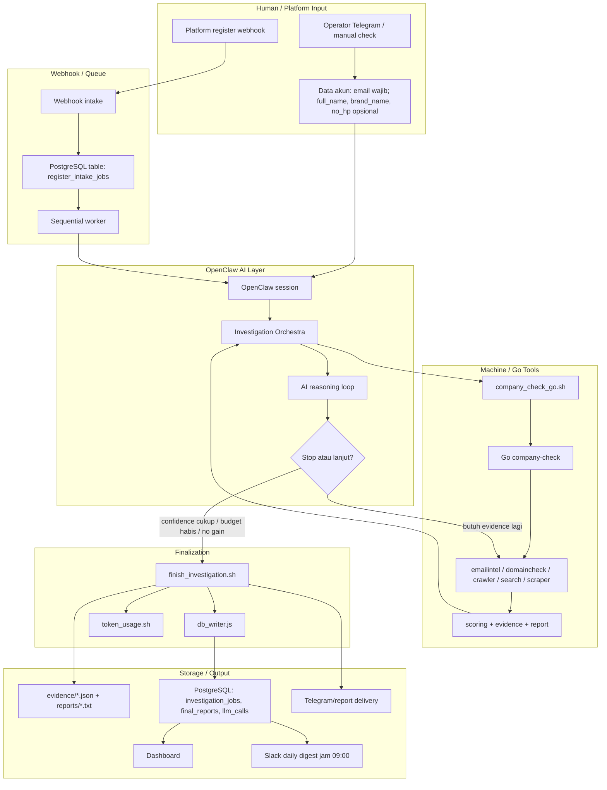

---

## 6. Sequence Detail — Input Masuk

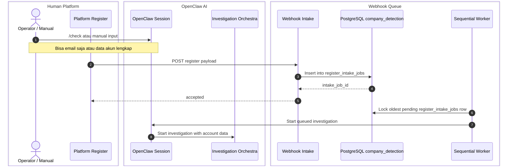

Input contract:

| Field | Required | Runtime Rule |
|---|---:|---|
| `email` | Yes | Primary signal; bisa `--email`, positional arg, atau JSON |
| `full_name` | No | Identity hint; alias: `fullName`, `name`, `nama` |
| `brand_name` | No | Business hint; alias: `brandName`, `company_field`, `company`, `brand` |
| `no_hp` | No | Confirmation only; alias: `noHp`, `phone`, `hp`; dimasking di report |

Accepted modes:

```bash
company-check --email user@gmail.com
company-check user@gmail.com

company-check \
  --email user@gmail.com \
  --full-name "Nama User" \
  --brand-name "Nama Brand" \
  --no-hp "08123456789"

company-check --input-json '{"email":"user@gmail.com","full_name":"Nama User","brand_name":"Nama Brand","no_hp":"08123456789"}'
```

---

## 7. Sequence Detail — Baseline Go Check

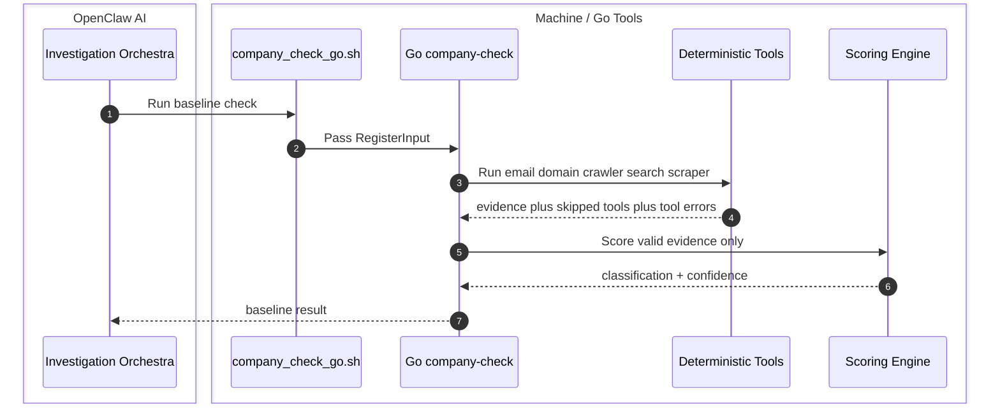

Main Go components:

| Component | Role |
|---|---|
| `emailintel` | free/custom/disposable/role email signals |
| `domaincheck` | DNS, MX, website status |
| `crawler` | lightweight website crawl |
| `search` | Google CSE if configured, Brave, Bing, DDG |
| `scraper` | page fetch/extraction |
| `brandhint` | brand-like local-part detection |
| `sociallinks` | social URL extraction |
| `rolesignal` | founder/owner/CEO signal detection |
| `scoring` | deterministic classification and confidence |
| `evidence` | JSON evidence snapshots |
| `report` | fallback human report |

---

## 8. Sequence Detail — AI / Orchestra Loop

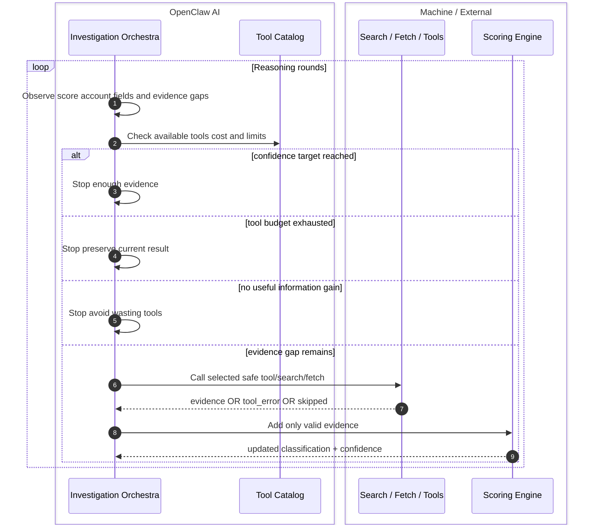

Rules:

- AI boleh memilih tool dan merangkum evidence.
- AI tidak boleh mengarang evidence.
- Failed tools masuk `tool_errors`, bukan evidence negatif.
- Skipped tools masuk `tools_skipped`.
- `no_hp` hanya untuk konfirmasi, bukan public search seed.
- Classification final tetap evidence-based dan deterministik.

---

## 9. Sequence Detail — Finalization, DB, Dashboard

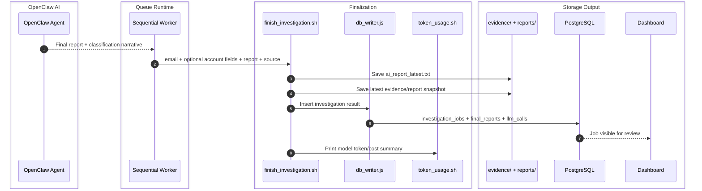

Important boundary:

- AI/OpenClaw Agent produces reasoning, classification narrative, and final report.
- Telegram manual flow may let OpenClaw execute the finalizer directly.
- Webhook queue flow lets the sequential worker execute the finalizer after OpenClaw returns the final report.
- `finish_investigation.sh` and `db_writer.js` perform file and database writes.
- Slack digest later reads from PostgreSQL; AI does not write directly to Slack or storage.

Command wajib setelah investigasi:

```bash
cd openclaw_workspace
scripts/finish_investigation.sh --email <email>
```

---

## 10. Storage Map

```text
File evidence/report
  openclaw_workspace/evidence/latest.json
  openclaw_workspace/reports/ai_report_latest.txt
        |
        v
db_writer.js
        |
        v
PostgreSQL
  investigation_jobs
  final_reports
  llm_calls
        |
        v
Dashboard
```

PostgreSQL adalah source of truth operasional. File evidence tetap dipakai untuk audit/debug.

---

## 11. Webhook Queue Path

Webhook adalah jalur platform register aktif. Targetnya bukan direct check, tetapi DB-backed queue lewat PostgreSQL table `register_intake_jobs`.

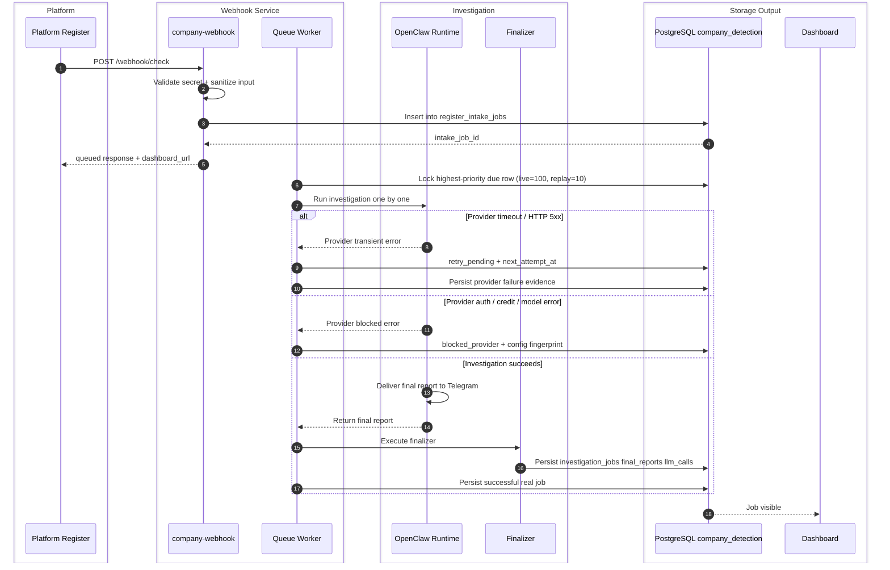

Worker rule:

- Default concurrency is one job at a time.
- One job is processed at a time. A delayed retry does not block newer due jobs.
- Transient provider failures remain retryable; they are not converted to false results.
- Provider-blocked jobs replay automatically after an AI config fingerprint change,
  or manually with `node worker.js replay-provider-failures --all --limit 25`.
- A six-hour timer admits at most 25 legacy failures at priority 10. New
  registrations at priority 100 preempt the backlog.
- Around 100 register payloads per day is small enough for sequential processing.
- Queue rows are persistent in PostgreSQL; they do not disappear daily.

### Operational alert sequence

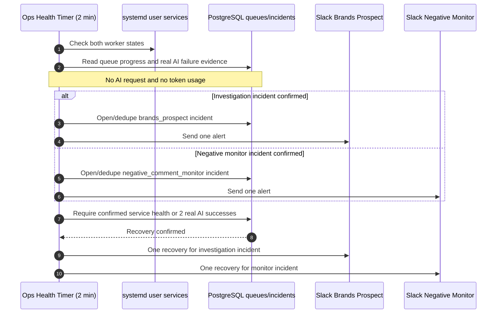

---

## 12. Slack Daily Digest Flow

Slack bukan output raw investigasi. Slack hanya daily handoff untuk sales/stakeholders.

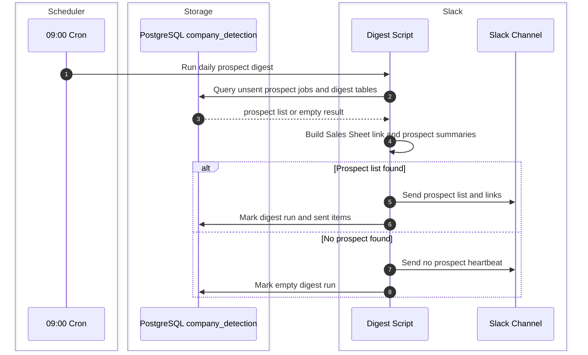

Slack content rule:

- Include browser Sales Sheet link in every digest (`/sales-sheet`).
- Do not include dashboard detail link per prospect in Slack.
- Include Hot/Warm priority, not internal scoring explanation.
- Include available website, marketplace, and social media summary per prospect.
- Show business-friendly summary only.
- Hide raw evidence, AI reasoning detail, scraping flow, tool errors, and scoring internals.

Prospect rule:

- `possible_company_affiliated` with confidence `>= 60`.
- `>= 75` is Hot prospect.
- `60-74` is Warm prospect.
- `--test-run` can send a `[TEST]` preview without marking production digest rows.

---

## 13. Classification Outputs

| Classification | Meaning |
|---|---|
| `possible_company_affiliated` | Business/company signal strong enough |
| `likely_personal_email` | Personal signal stronger, no business evidence |
| `unknown_needs_more_evidence` | Not enough evidence |
| `suspicious_or_invalid` | Invalid/disposable/risky |

---

## 14. Current Status

Validated:

- Manual/Telegram input path.
- Go deterministic baseline.
- OpenClaw reasoning loop.
- `finish_investigation.sh`.
- PostgreSQL storage through finalizer.
- Dashboard.
- Webhook intake queue.
- Sequential worker.
- Slack daily prospect digest at 09:00.

Pending external validation:

- Platform register validation.
