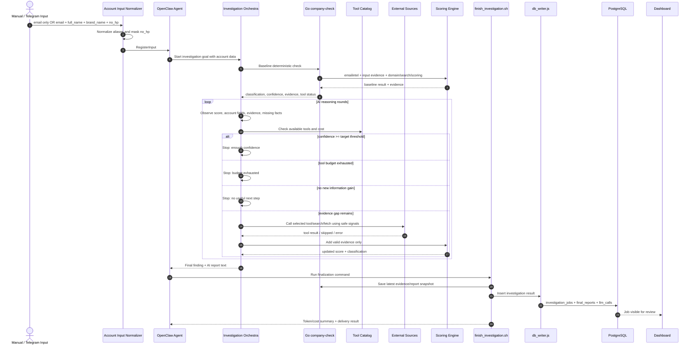
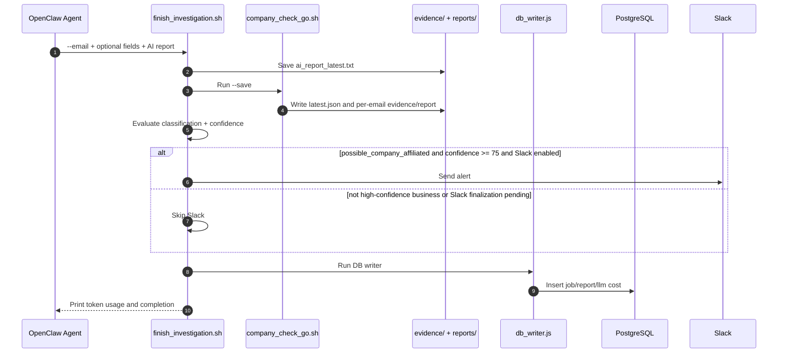
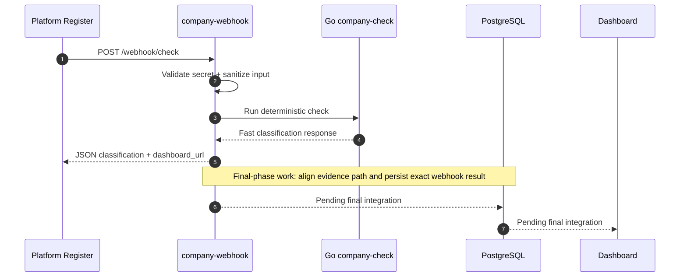

# Flow Map

**Project:** AI Company Detection Agent  
**Audience:** Developer / AI agent penerus  
**Status:** Active runtime map  
**Last updated:** 20 Mei 2026

---

## 1. Fungsi Dokumen Ini

Dokumen ini menjelaskan **alur runtime teknis**: komponen mana yang dipanggil, bagaimana orchestrator melakukan loop investigasi, kapan stop, dan bagaimana finalizer menyimpan report ke DB.

Bedanya dengan [High Level Business Flow](../product/HIGH_LEVEL_BUSINESS_FLOW.md):

| Dokumen | Fokus | Pembaca |
|---|---|---|
| High Level Business Flow | Alur bisnis dari input akun sampai dashboard/Slack | Product, operator, business |
| Flow Map | Runtime teknis, orchestrator, loop, stop condition, storage path | Developer, AI agent |

---

## 2. Runtime Sequence Utama



---

## 3. Current Validated Path

```text
OpenClaw/Telegram/manual input: email only or full account data
  -> Investigation Orchestra
  -> Go deterministic baseline
  -> AI reasoning loop
  -> finish_investigation.sh
  -> db_writer.js
  -> PostgreSQL
  -> Dashboard
```

This is the currently validated persistence path.

---

## 4. Input Contract

| Field | Required | Runtime Rule |
|---|---:|---|
| `email` | Yes | Primary signal; can be passed as `--email`, positional arg, or JSON |
| `full_name` | No | Identity hint; can also arrive as `fullName`, `name`, or `nama` |
| `brand_name` | No | Business hint; can also arrive as `brandName`, `company_field`, `company`, or `brand` |
| `no_hp` | No | Confirmation only; can also arrive as `noHp`, `phone`, or `hp`; stored masked in reports |

Accepted input modes:

```bash
company-check --email user@gmail.com
company-check user@gmail.com

company-check \
  --email user@gmail.com \
  --full-name "Nama User" \
  --brand-name "Nama Brand" \
  --no-hp "08123456789"

company-check --input-json '{"email":"user@gmail.com","full_name":"Nama User","brand_name":"Nama Brand","no_hp":"08123456789"}'
```

---

## 5. Deterministic Baseline

The baseline runs through Go:

```text
openclaw_workspace/scripts/company_check_go.sh
  -> go-service/cmd/company-check
```

Main Go components:

| Component | Role |
|---|---|
| `emailintel` | free/custom/disposable/role email signals |
| `domaincheck` | DNS, MX, website status |
| `crawler` | lightweight website crawl |
| `search` | Google CSE if configured, Brave, Bing, DDG |
| `scraper` | page fetch/extraction |
| `brandhint` | brand-like local-part detection |
| `sociallinks` | social URL extraction |
| `rolesignal` | founder/owner/CEO signal detection |
| `scoring` | deterministic classification and confidence |
| `evidence` | JSON evidence snapshots |
| `report` | fallback human report |

---

## 6. AI Reasoning Loop

The AI loop is controlled by OpenClaw and `AGENTS.md`.

Each round:

1. Observe current result.
2. Identify evidence gaps.
3. Decide whether another tool is worth the cost.
4. Call tool if useful.
5. Accept only valid evidence.
6. Re-score deterministically.
7. Stop or loop.

Stop branches:

| Stop Branch | Meaning |
|---|---|
| Confidence target reached | Enough evidence to classify |
| Tool budget exhausted | Stop to control cost |
| No new information gain | More tools likely wasteful |
| Evidence remains weak | Classify as `unknown_needs_more_evidence` |
| Suspicious/invalid signal found | Classify as `suspicious_or_invalid` |

Rules:

- Failed tools are `tool_errors`, not evidence.
- Skipped tools are `tools_skipped`.
- AI must not invent evidence.
- `no_hp` must not be used for public search.

---

## 7. Finalization Sequence



Command:

```bash
cd openclaw_workspace
scripts/finish_investigation.sh --email <email>
```

---

## 8. Storage Map

```text
Go evidence/report files
  evidence/latest.json
  reports/ai_report_latest.txt
        |
        v
db_writer.js
        |
        v
PostgreSQL
  investigation_jobs
  final_reports
  llm_calls
        |
        v
Dashboard
```

PostgreSQL is the operational source of truth. File evidence remains the audit/debug artifact.

---

## 9. Webhook Path Status

Webhook is a final integration path, not the currently validated persistence path.



---

## 10. Classification Outputs

| Classification | Meaning |
|---|---|
| `possible_company_affiliated` | Business/company signal strong enough |
| `likely_personal_email` | Personal signal stronger, no business evidence |
| `unknown_needs_more_evidence` | Not enough evidence |
| `suspicious_or_invalid` | Invalid/disposable/risky |

---

## 11. Current Status

Validated:

- Go baseline.
- OpenClaw reasoning loop.
- `finish_investigation.sh`.
- PostgreSQL storage through finalizer.
- Dashboard.

Final integration pending:

- Webhook DB persistence path.
- Slack high-confidence routing.
- Platform register validation.
