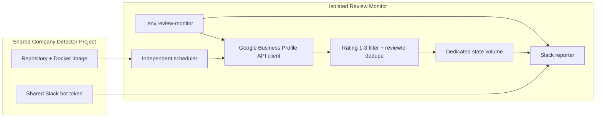
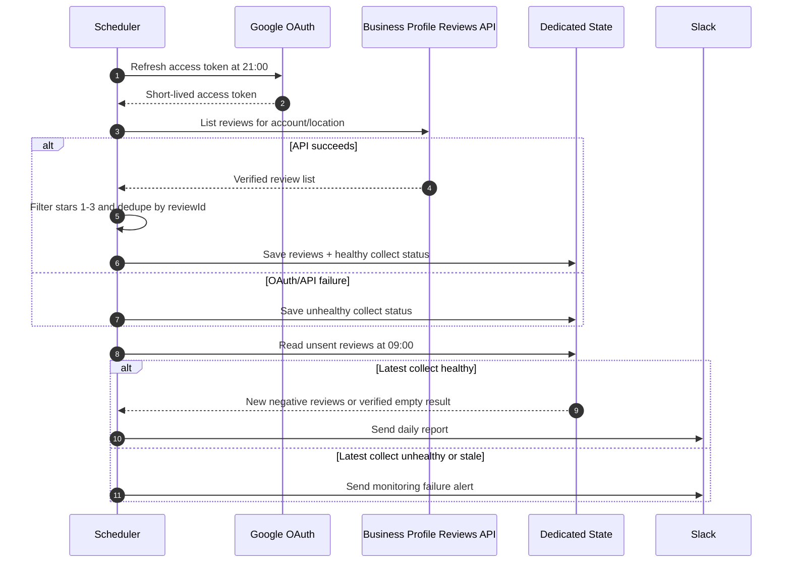

# Google Business Profile Review Monitor

> This document describes the current Google-only implementation and
> operations. The target cross-platform architecture is documented in
> `NEGATIVE_FEEDBACK_MONITOR_ARCHITECTURE.md`. Current negative feedback production MVP uses Meta Graph polling; this Google path remains pending API approval.

## Purpose

Monitor review Google Business Profile berbintang 1-3 sebagai fitur
deterministic yang terisolasi dari Company Detector investigation flow.

Dalam target Unified Negative Feedback Monitor, modul ini menjadi Google
connector. Keputusan negatif Google tetap berdasarkan rating 1-3 dan tidak
boleh memakai AI. Google Pub/Sub notifications menjadi primary event path,
sedangkan API reconciliation hanya menjadi optional recovery untuk event yang
terlewat.

Development menggunakan profil warung pribadi yang dimiliki/dikelola akun
Google personal. Production nanti mengganti credential dan location ke Google
Business Profile Komerce tanpa mengubah kode atau flow.

```text
21:00 WIB -> Google Business Profile API collect + deduplicate
09:00 WIB -> Slack daily report
```

## Product Status

```text
Implementation: ready for Google Business Profile API credentials
OAuth bootstrap tools: ready
Separate env and Compose profile: ready
Slack test-send: passed to monitor-negatif-company
Real API collection: waiting for personal Google OAuth/account/location setup
Production scheduler: disabled until API preflight passes
```

## Isolation Contract

- Satu repository dan Docker image dengan Company Detector.
- Service Compose terpisah: `review-monitor`.
- Opt-in profile: normal Company Detector deployment tidak menyalakannya.
- Secret terpisah: `.env.review-monitor`.
- Scheduler terpisah: `ops/docker/review-monitor-scheduler.js`.
- State/deduplication terpisah: `company_detector_review_monitor`.
- Tidak memanggil OpenClaw/LLM.
- Tidak membaca/menulis investigation tables.
- Boleh berbagi Docker, Slack integration, dan operations infrastructure.
- Kelak boleh berbagi normalized feedback database dengan Meta monitor, tetapi
  tetap tidak boleh menyentuh investigation tables.
- Tidak boleh memanggil Meta AI classifier.

## Target Migration

Current implementation memakai official API polling dan dedicated JSON state.
Setelah Google Business Profile API access tersedia, migrasi dilakukan
bertahap:

1. Validasi collector/API saat ini terhadap profil development.
2. Tambahkan dedicated feedback PostgreSQL tables.
3. Migrasikan dedupe/sent state dari JSON ke feedback tables.
4. Tambahkan Google Pub/Sub notification receiver untuk `NEW_REVIEW` dan
   `UPDATED_REVIEW`.
5. Kirim setiap hasil review yang selesai ke Telegram.
6. Kirim langsung ke Slack monitoring hanya jika rating 1-3.
7. Gunakan scheduled reconciliation hanya sebagai optional recovery.
8. Pertahankan rating 1-3 sebagai satu-satunya negative decision rule.

## Architecture Flowchart



## Runtime Sequence



## Separate Environment File

Review monitor secrets must not be mixed into core Company Detector `.env`.

```bash
cp .env.review-monitor.example .env.review-monitor
chmod 600 .env.review-monitor
```

Required values:

```text
GBP_BUSINESS_NAME=
GBP_ACCOUNT_ID=
GBP_LOCATION_ID=
GBP_CLIENT_ID=
GBP_CLIENT_SECRET=
GBP_REFRESH_TOKEN=
REVIEW_MONITOR_SLACK_CHANNEL=monitor-negatif-company
```

Never commit or share `.env.review-monitor`. OAuth client secret and refresh
token provide access to the Google Business Profile managed by that account.

## Development Setup With Personal Warung

Requirements:

- The personal Google account is owner/manager of the warung Business Profile.
- The profile is verified and visible in Google Business Profile.
- A Google Cloud project is created for development.
- Google Business Profile APIs are enabled and API access is approved.
- OAuth client type is Desktop App or another approved internal setup.

Fill `GBP_CLIENT_ID` and `GBP_CLIENT_SECRET`, then generate the authorization
URL:

```bash
docker compose --profile review-monitor run --rm \
  review-monitor node review_monitor/oauth.js auth-url
```

Open the URL, login using the personal account that manages the warung, grant
access, then exchange the returned authorization code:

```bash
docker compose --profile review-monitor run --rm \
  review-monitor node review_monitor/oauth.js exchange-code '<AUTHORIZATION_CODE>'
```

Install the resulting `GBP_REFRESH_TOKEN` into `.env.review-monitor` through a
secure editor.

Discover account and location IDs:

```bash
docker compose --profile review-monitor run --rm \
  review-monitor node review_monitor/oauth.js list-accounts

# Fill GBP_ACCOUNT_ID, then:
docker compose --profile review-monitor run --rm \
  review-monitor node review_monitor/oauth.js list-locations
```

The API outputs names such as `accounts/123` and `locations/456`. Store only
the numeric ID portions in `GBP_ACCOUNT_ID` and `GBP_LOCATION_ID`.

## Acceptance And Activation

Run the dedicated preflight:

```bash
chmod +x ops/docker/verify-review-monitor.sh
./ops/docker/verify-review-monitor.sh
```

The preflight validates:

- `.env.review-monitor` exists with permission `600`.
- No placeholder remains.
- OAuth/account/location/Slack channel and shared bot token exist.
- Google Business Profile Reviews API collection succeeds.
- Slack test-send succeeds.

Only after preflight passes:

```bash
docker compose --profile review-monitor up -d review-monitor
docker compose logs -f review-monitor
```

## Commands

```bash
# Collect real reviews without sending:
docker compose --profile review-monitor run --rm \
  review-monitor node review_monitor/monitor.js collect

# Send real unsent reviews or verified-empty report:
docker compose --profile review-monitor run --rm \
  review-monitor node review_monitor/monitor.js send

# Slack format test with dummy data:
docker compose --profile review-monitor run --rm \
  review-monitor node review_monitor/monitor.js test-send
```

## Safety Behavior

- API/OAuth failure is stored as unhealthy collection.
- The 09:00 report sends a monitoring failure alert when collection is
  unhealthy or older than 36 hours.
- A verified-empty message is sent only after the official API successfully
  returned a review list.
- Refresh tokens and OAuth secrets never enter Git, image layers, or docs.

## Move From Personal Warung To Komerce

No code change is required.

1. Create/approve the office Google Cloud project and OAuth client.
2. Authorize using an office account that manages the Komerce Business Profile.
3. Replace only the `.env.review-monitor` values:
   `GBP_BUSINESS_NAME`, account/location IDs, OAuth client, refresh token.
4. Run `verify-review-monitor.sh`.
5. Enable the scheduler only after the production preflight passes.

Do not reuse personal OAuth credentials for production.

## Acceptance Checklist

- [ ] OAuth account manages the intended development warung profile.
- [ ] `list-accounts` and `list-locations` return expected IDs.
- [ ] API collector returns verified reviews or verified empty result.
- [ ] Only rating 1-3 reviews are stored.
- [ ] Repeated collection deduplicates by stable Google `reviewId`.
- [ ] Slack `test-send` reaches monitor-negatif-company.
- [ ] Failed/stale collection sends failure alert, not false-empty result.
- [ ] Scheduler logs show collect 21:00 and send 09:00 WIB.
- [ ] Investigation worker/OpenClaw/database remain unchanged.
