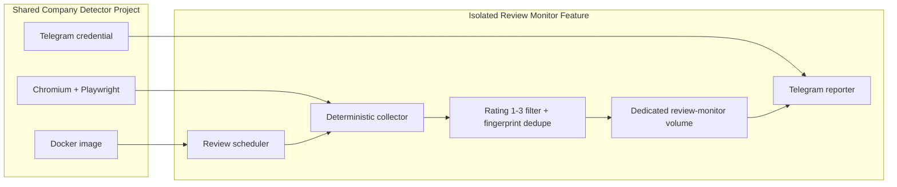
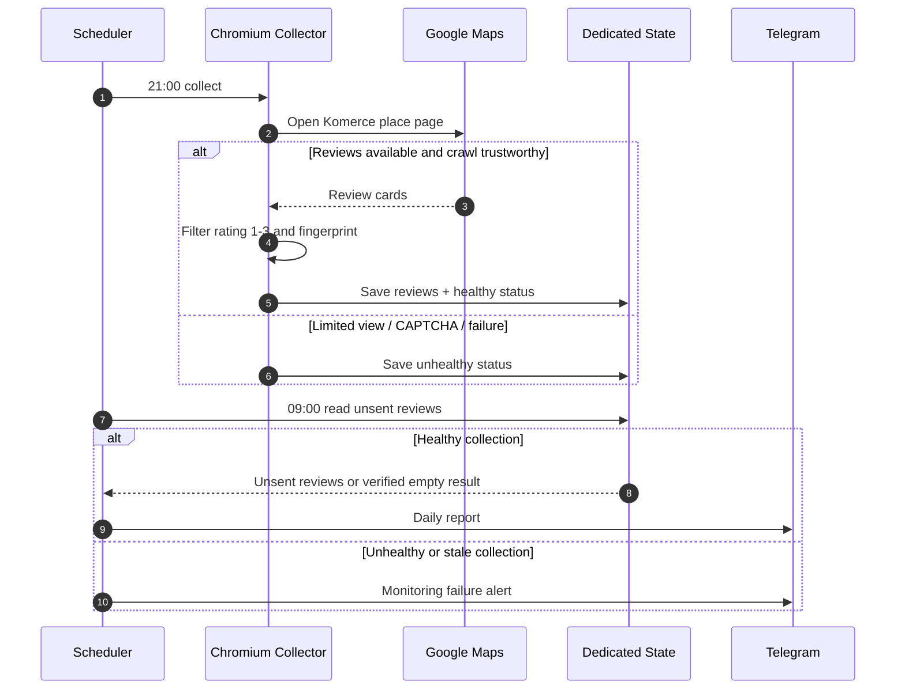

# Google Business Review Monitor

## Purpose

Monitor review Google Maps Komerce berbintang 1-3 sebagai fitur yang sepenuhnya
terpisah dari Company Detector investigation flow.

```text
21:00 WIB -> browser crawler collect + deduplicate
09:00 WIB -> Telegram daily report
```

Monitor ini deterministic dan tidak menggunakan AI agent.

## Product Status

```text
Implementation: complete as isolated opt-in Docker feature
Telegram test-send: passed
Anonymous Maps crawl: correctly rejected as limited view
Production scheduler: intentionally disabled until authenticated crawl passes
```

## Isolation Contract

- Service: `review-monitor`
- Source: `review_monitor/`
- Scheduler: `ops/docker/review-monitor-scheduler.js`
- State volume: `company_detector_review_monitor`
- Environment prefix: `REVIEW_MONITOR_*`
- Tidak membaca atau menulis investigation tables.
- Tidak memanggil OpenClaw agent, register worker, scoring, atau prospect digest.
- Compose profile `review-monitor` membuat fitur opt-in; normal Company Detector
  deployment tidak akan menyalakannya.

## Architecture Flowchart



## Runtime Sequence



## Configuration

```text
REVIEW_MONITOR_BUSINESS_NAME=Komerce
REVIEW_MONITOR_MAPS_URL=<direct Google Maps place URL>
REVIEW_MONITOR_COLLECT_HOUR_WIB=21
REVIEW_MONITOR_SEND_HOUR_WIB=9
REVIEW_MONITOR_MINUTE_WIB=0
REVIEW_MONITOR_TELEGRAM_TO=<Telegram chat ID>
TELEGRAM_DEFAULT_BOT_TOKEN=<bot token>
```

Google Maps may return a limited view without review data to anonymous
headless browsers. For browser-crawler mode, provide an authenticated
Playwright storage-state file through a secure read-only mount and set:

```text
REVIEW_MONITOR_STORAGE_STATE=/run/secrets/google-maps-storage-state.json
```

Never commit the storage-state file. It contains authenticated Google session
cookies and must be treated as a secret.

Use the opt-in Compose override:

```bash
export REVIEW_MONITOR_STORAGE_STATE_HOST=/secure/google-maps-storage-state.json
docker compose \
  --profile review-monitor \
  -f compose.yml \
  -f compose.review-monitor.yml \
  up -d review-monitor
```

## Safety Behavior

The monitor must not report "no negative reviews" when crawling fails or Google
returns limited data. It records the latest collect status and sends a Telegram
failure alert instead.

## Commands

Test Telegram delivery with a dummy review:

```bash
docker compose run --rm review-monitor node review_monitor/monitor.js test-send
```

Collect without sending:

```bash
docker compose run --rm review-monitor node review_monitor/monitor.js collect
```

Send the stored daily report:

```bash
docker compose run --rm review-monitor node review_monitor/monitor.js send
```

Start the isolated scheduler only after authenticated crawling succeeds:

```bash
docker compose \
  --profile review-monitor \
  -f compose.yml \
  -f compose.review-monitor.yml \
  run --rm review-monitor node review_monitor/monitor.js collect

docker compose \
  --profile review-monitor \
  -f compose.yml \
  -f compose.review-monitor.yml \
  up -d review-monitor
```

## Acceptance Checklist

- [ ] Direct Maps URL opens the intended Komerce location.
- [ ] Authenticated collector does not return limited view or CAPTCHA.
- [ ] Collector observes review cards and stores a healthy status.
- [ ] Only rating 1-3 reviews are stored.
- [ ] Repeated collection does not duplicate fingerprints.
- [ ] `test-send` reaches the intended Telegram chat.
- [ ] A failed/stale collection sends a failure alert, not a false-empty report.
- [ ] Investigation worker, OpenClaw gateway, scoring, and DB remain unchanged.
- [ ] Scheduler logs show next collect at 21:00 and next send at 09:00 WIB.

## Operational Failure Modes

| Failure | Expected behavior | Operator action |
|---|---|---|
| Google limited view | Collect fails and records unhealthy status | Refresh authenticated storage-state |
| CAPTCHA / unusual traffic | Collect fails; no false-empty result | Pause and review crawl method |
| Telegram credential/target invalid | Send exits non-zero | Repair `REVIEW_MONITOR_TELEGRAM_TO` or token |
| Storage-state expired | Failure alert at report time | Generate and install a new session file |
| Google UI selector changes | Collect fails or observes zero cards | Update and retest collector before enabling |

## Current Test Result

On 10 June 2026:

- VPS anonymous HTTP request reached Google Maps without CAPTCHA.
- Browser crawler found the correct Komerce profile.
- Google Maps returned a limited view without the review list.
- Telegram dummy-review test succeeded.

Do not enable the scheduler until an authenticated crawler session succeeds or
the implementation is moved to the official Google Business Profile API.
