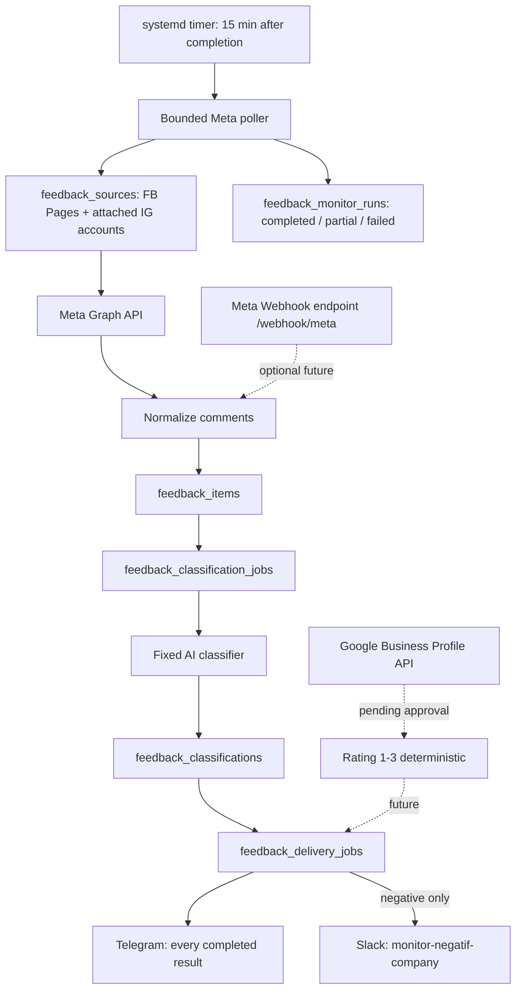

# Negative Feedback Monitor Architecture

**Feature:** Google Business Profile + Meta negative feedback monitoring  
**Status:** Meta polling MVP active on VPS; webhook remains optional/future  
**Last updated:** 29 Juni 2026

---

## 1. Purpose

Fitur ini memantau feedback negatif untuk aset Komerce dan mengirim hasilnya ke channel operasional:

- Google Business Profile reviews.
- Facebook Page comments.
- Instagram Professional Account comments.
- Nanti dapat diperluas ke Facebook/Instagram ad comments jika permission dan mapping asset sudah siap.

Fitur tetap berada di repository Company Detector agar berbagi Docker, PostgreSQL, Slack bot, Telegram bot, logging, dan operational tooling. Namun lifecycle, schema, queue, env, dan worker-nya terisolir dari fitur investigasi register.

## 2. Current Production Model

Model aktif saat ini adalah **Meta Graph API polling**, bukan webhook.

```text
systemd timer: next run 15 minutes after prior run completes
  -> node feedback_monitor/worker.js poll-meta
  -> Meta Graph API pages/media/comments
  -> PostgreSQL feedback tables
  -> AI classifier for new Meta comments only
  -> Telegram for every completed result
  -> Slack monitor-negatif-company only when negative
```

Webhook endpoint disiapkan sebagai opsi masa depan, tetapi belum menjadi sumber aktif karena Meta App belum dikonfigurasi untuk subscribe callback production.

Konfigurasi VPS saat ini:

| Setting | Value |
|---|---|
| Poll interval | 15 menit |
| Lookback window | 1440 menit / 24 jam |
| FB/IG post/media limit | 100 terbaru per source |
| Comment limit | 50 komentar per post/media |
| Page concurrency | 2 page paralel |
| Comment request concurrency | 5 request paralel per source |
| Telegram | Semua hasil selesai |
| Slack | Hanya komentar negatif |
| AI usage | Hanya untuk komentar Meta baru/berubah |

## 3. Core Product Decision

Google dan Meta tidak memakai algoritma penentuan negatif yang sama.

| Source | Cara menentukan negatif | AI |
|---|---|---|
| Google Business Profile | Review rating 1-3 dianggap negatif | Tidak digunakan |
| Facebook Page comments | Structured AI classification dari isi komentar dan konteks minimum | Digunakan |
| Instagram comments | Structured AI classification dari isi komentar dan konteks minimum | Digunakan |
| Facebook/Instagram ad comments | Target lanjutan, tetap structured AI classification | Digunakan |

Alasannya:

- Google sudah punya sinyal eksplisit berupa rating.
- Komentar Meta tidak punya rating dan bisa berisi keluhan halus, candaan, spam, sarkasme, atau pertanyaan.
- AI di fitur ini hanya classifier tetap. Ia bukan OpenClaw agent, tidak memakai ReAct loop, dan tidak melakukan investigasi web.

## 4. Active Flow



## 5. Source Coverage

`sync-meta-pages` menyimpan Facebook Page yang dapat diakses token dan Instagram Business Account yang attached pada page tersebut.

Sumber dipisahkan di database:

| Source | Meaning |
|---|---|
| `facebook_page` | Komentar dari Facebook Page post |
| `instagram` | Komentar dari Instagram media/reels melalui IG Business Account |
| `google_business` | Target Google review monitor setelah API access approved |

Per source disimpan label bisnis/account agar report dapat membedakan:

```text
Instagram
Nama Instagram/FB Page: Kolkit.id

Facebook Page
Nama Instagram/FB Page: Komerce
```

## 6. Delivery Contract

Telegram menerima semua hasil yang selesai, baik negatif maupun bukan negatif. Slack monitoring hanya menerima hasil negatif.

Format report:

```text
Feedback Monitoring Result

Instagram/Facebook Page
Nama Instagram/FB Page: <nama source>
Komentar: <isi komentar>
Kesimpulan: Negatif / Tidak negatif / Perlu review
Alasan: <kenapa dianggap negatif atau bukan>
Link komentar/postingan: <permalink jika tersedia>

Author: <nama author jika tersedia>
Urgency: <low|medium|high|critical>
Category: <kategori>
```

Slack title untuk komentar negatif:

```text
Negative Feedback Alert
```

## 7. AI Classifier Contract

Meta classifier memakai satu prompt tetap dan structured JSON output.

Input minimum:

- Source type: Facebook Page atau Instagram.
- Nama page/account.
- Isi komentar.
- Author jika tersedia.
- Link komentar/postingan jika tersedia.
- Konteks parent post/media jika tersedia.

Output wajib:

```json
{
  "sentiment": "negative|non_negative|ambiguous",
  "negative_score": 0,
  "confidence": 0,
  "urgency": "low|medium|high|critical",
  "category": "product|service|delivery|billing|fraud_claim|legal|privacy|other",
  "needs_response": true,
  "reason_short": "one concise operational reason"
}
```

Routing default:

| Result | Action |
|---|---|
| `negative`, score >= 70, confidence >= 70 | Telegram + Slack |
| `negative`, urgency `critical` | Telegram + Slack |
| `ambiguous` atau confidence rendah | Telegram only sebagai perlu review |
| `non_negative` | Telegram only |
| Provider/model/API error | Retry, lalu `blocked_provider`; jangan dianggap aman |

## 8. Queue And Retry Model

Fitur monitoring memakai PostgreSQL queue sendiri, bukan `register_intake_jobs`.

Prinsipnya mirip investigasi register:

```text
ingest/poll comment
  -> store durable row
  -> lock oldest pending job with FOR UPDATE SKIP LOCKED
  -> classify one by one
  -> enqueue Telegram and maybe Slack
```

Kegagalan AI tidak boleh menghapus komentar dan tidak boleh dianggap non-negative.

Status penting:

| Status | Meaning |
|---|---|
| `pending` | Menunggu diproses |
| `retry_pending` | Gagal sementara, akan dicoba lagi |
| `blocked_provider` | Provider/key/model bermasalah; replay setelah config diperbaiki |
| `completed` | Sudah ada hasil klasifikasi |
| `dead_letter` | Payload rusak dan butuh intervensi manual |

Operator dapat menjalankan replay setelah model/key diperbaiki:

```bash
node feedback_monitor/worker.js replay-blocked
```

## 9. Service Boundaries

| Component | Responsibility |
|---|---|
| `company-feedback-monitor-ingress` | HTTP endpoint health/webhook placeholder |
| `company-feedback-monitor-worker` | Queue worker, classifier, delivery |
| `company-feedback-meta-poller.timer` | Menjalankan poll berikutnya 15 menit setelah run sebelumnya selesai |
| `feedback_monitor/worker.js sync-meta-pages` | Sinkronisasi daftar FB Page dan IG account |
| `feedback_monitor/worker.js poll-meta` | Ambil komentar baru dari Meta Graph API |
| `feedback_monitor/worker.js status` | Cek queue, source, dan delivery status |
| `feedback_monitor_runs` | Audit durasi, page sukses/gagal, dan jumlah event baru setiap poll |
| `company-ops-health.timer` | Alert jika timer mati, poll gagal, atau poll stale lebih dari 60 menit |

## 10. Meta Webhook Future Path

Webhook bisa menggantikan atau melengkapi polling kalau sudah siap.

Syarat webhook aktif:

1. Meta App callback URL mengarah ke `/webhook/meta`.
2. Verify token sama dengan `META_WEBHOOK_VERIFY_TOKEN`.
3. App subscribed ke field komentar Page/Instagram yang dibutuhkan.
4. Request signature divalidasi dengan `META_APP_SECRET`.
5. Ingress hanya menyimpan event dan ACK; worker tetap yang hydrate/classify/deliver.

Selama ini belum selesai, **jangan tulis dokumentasi seolah webhook sudah menjadi sumber utama**.

## 11. Google Business Profile Future Path

Google review monitoring menunggu Google Business Profile API approval.

Setelah access approved:

```text
Google Business Profile review
  -> rating 1-3 = negative
  -> rating 4-5 = non-negative/audit
  -> Telegram all completed results
  -> Slack only rating 1-3
```

Google path tidak memakai AI dan tidak mengonsumsi token LLM.

## 12. Operational Commands

```bash
# Sync accessible FB Pages and attached IG Business Accounts
node feedback_monitor/worker.js sync-meta-pages

# Poll recent FB/IG comments
node feedback_monitor/worker.js poll-meta

# Process one pending classification/delivery job
node feedback_monitor/worker.js once

# Show monitor status
node feedback_monitor/worker.js status

# Replay provider-blocked jobs after model/key/provider is fixed
node feedback_monitor/worker.js replay-blocked
```

Production timer:

```text
company-feedback-meta-poller.timer -> 15 minutes after the previous run finishes
```

## 13. Important Non-Goals

- Tidak memakai OpenClaw agent.
- Tidak mengubah flow investigasi register.
- Tidak mengirim komentar non-negative ke Slack.
- Tidak memakai AI untuk Google rating.
- Tidak memanggil AI untuk polling kosong; token hanya dipakai untuk komentar baru/berubah yang perlu diklasifikasi.
- Poller memakai bounded concurrency dan tidak menjalankan catch-up loop `Persistent`.
